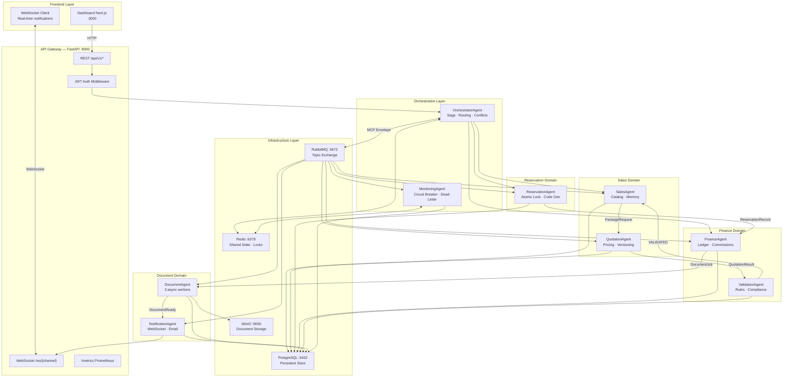
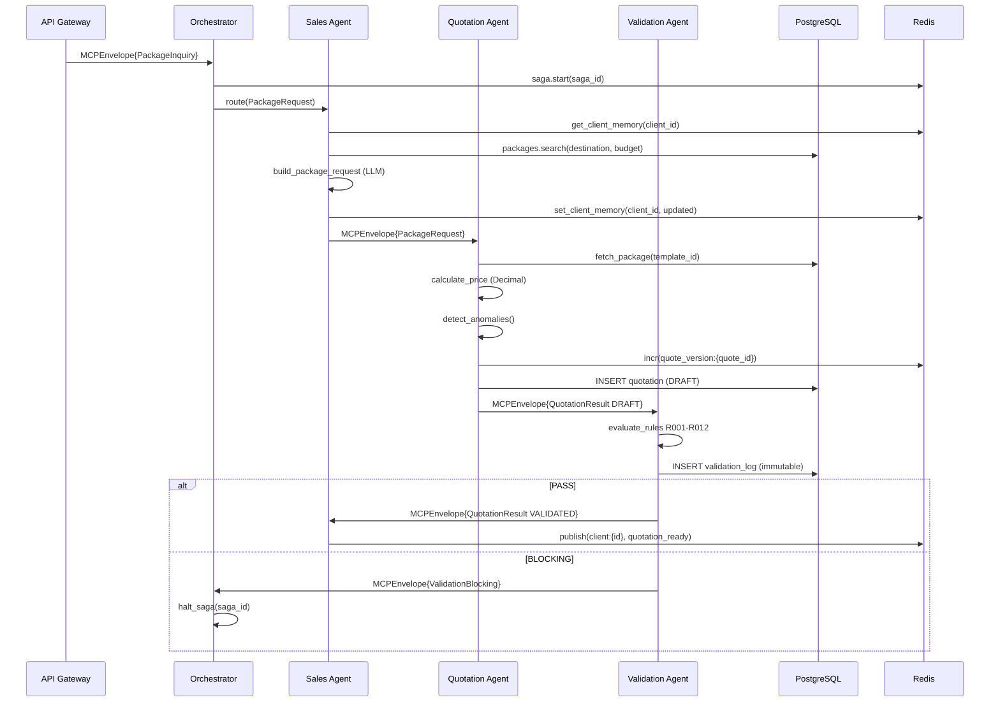
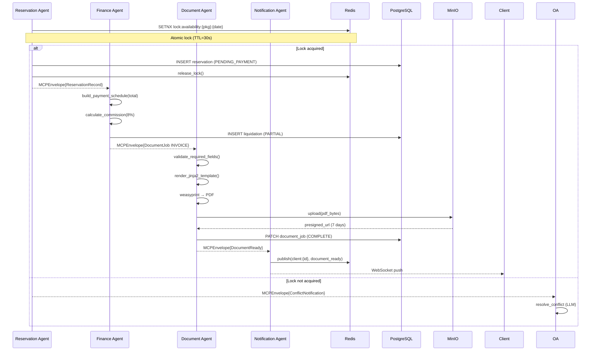
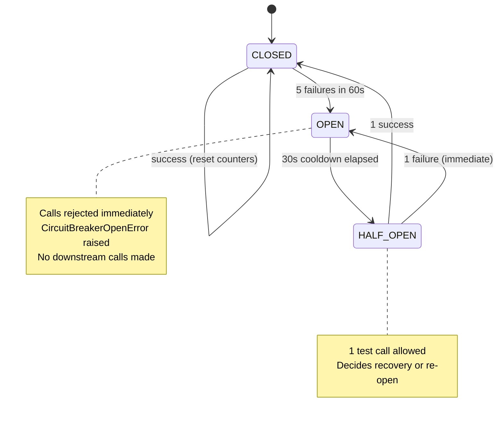
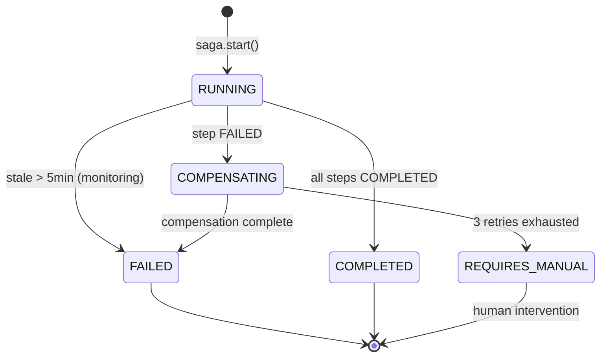
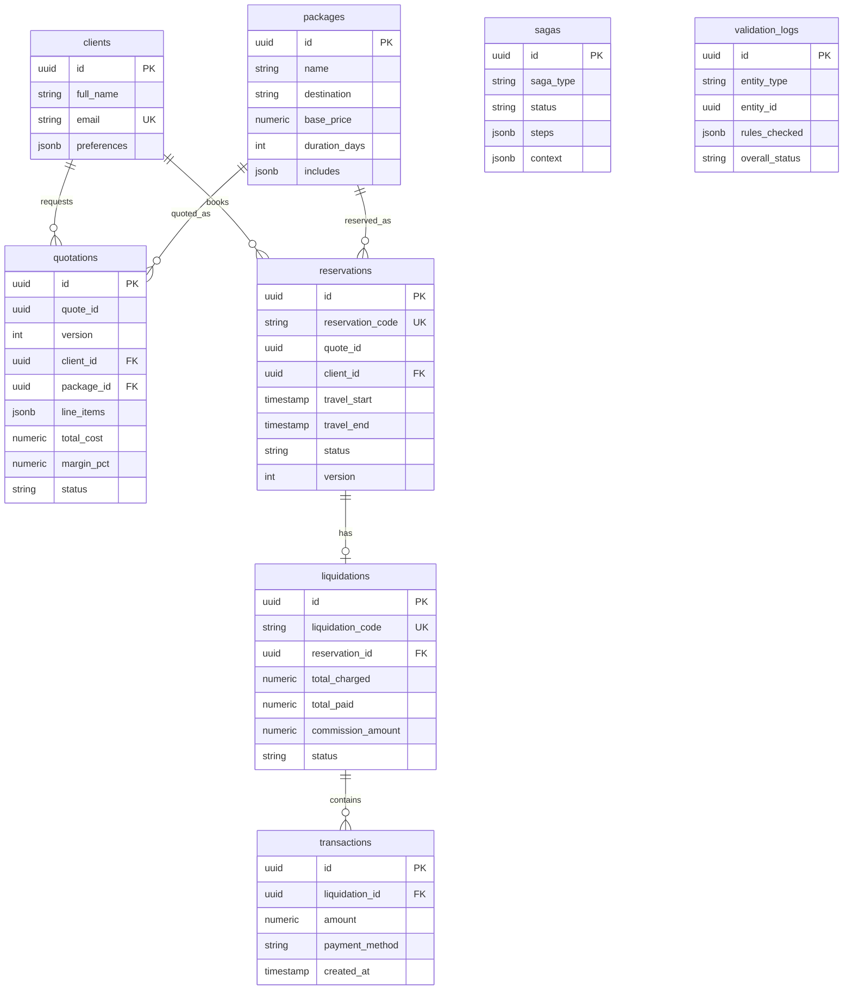
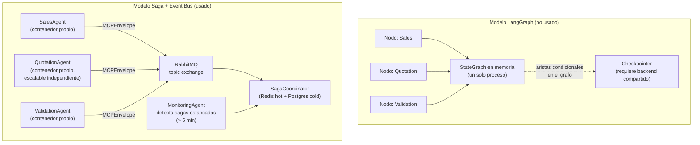
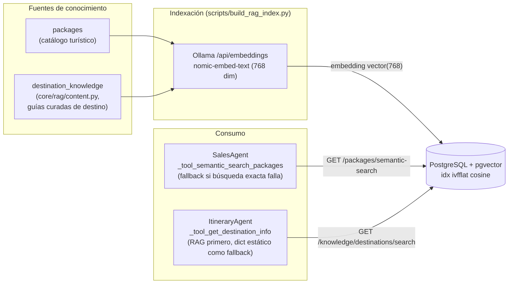
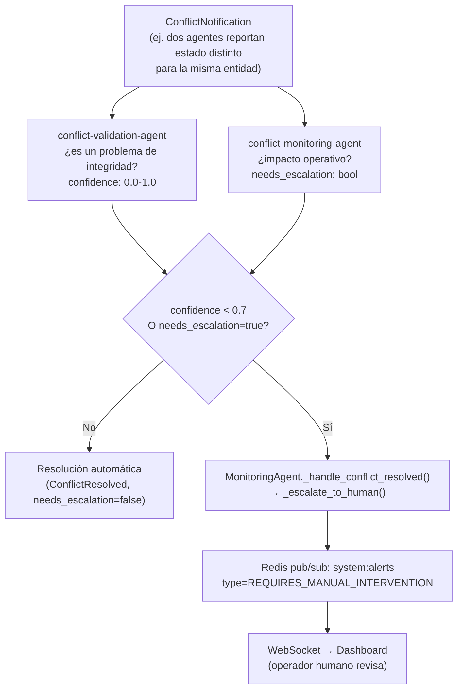
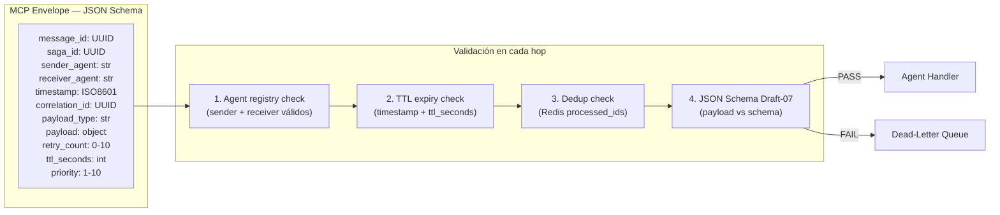

# Arquitectura del Sistema Multiagente — Everywhere Travel

> **Nota sobre notación:** los diagramas de esta sección usan **Mermaid** (sequenceDiagram,
> stateDiagram, erDiagram, flowchart) porque renderizan directamente en GitHub/editores
> Markdown. Adicionalmente existe un **diagrama BPMN 2.0 formal** del flujo principal
> (Escenario A: cotización) en [`docs/bpmn/escenario_a_cotizacion.bpmn`](bpmn/escenario_a_cotizacion.bpmn)
> — es XML estándar BPMN 2.0 con lanes por agente (API Gateway, Orchestrator, Sales,
> Quotation, Validation), gateway exclusivo para el caso BLOCKING y eventos de fin
> COMPLETED/FAILED. Se abre en [demo.bpmn.io](https://demo.bpmn.io), Camunda Modeler o
> draw.io (importar BPMN), desde donde puede exportarse como imagen para el informe.

## 1. Diagrama de Componentes (Mermaid)



## 2. Diagrama de Secuencia — Escenario A: Paquete Personalizado



## 3. Diagrama de Secuencia — Escenario C: Reserva + Liquidación + Documentos



## 4. Diagrama de Estado — Circuit Breaker



## 5. Diagrama de Estado — Saga



## 6. Diagrama ER — Entidades principales



## 7. Orquestación: Saga + Event Bus vs. LangGraph

Este sistema **no usa LangGraph**. La orquestación es un patrón Saga (`core/saga_coordinator.py`)
sobre un event bus (RabbitMQ), con cada agente como proceso/contenedor independiente —
justificación completa en [ADR-001](adr/ADR-001-saga-vs-langgraph.md).



**Por qué el modelo de la derecha:** cada agente ya necesita ser un proceso independiente
(Document Agent corre en 3 réplicas; cualquier agente puede caerse sin tumbar a los demás).
LangGraph asume que el grafo vive en un solo proceso con un checkpointer compartido —
forzar esa forma sobre 9 contenedores independientes habría significado reconstruir a mano
el mismo event bus que RabbitMQ ya provee, sin ganar nada a cambio. El "checkpointing" de
LangGraph se resuelve aquí con el log de pasos de la Saga en Redis + Postgres, que además
sirve como auditoría permanente (`sagas.steps`), algo que un checkpointer de grafo no da
gratis.

## 7bis. Subsistema RAG

`SalesAgent` e `ItineraryAgent` recuperan conocimiento por similaridad semántica en vez de
match exacto de string — justificación completa en [ADR-009](adr/ADR-009-rag-pgvector.md).



Flujo de recuperación: la consulta del cliente (destino + preferencias) se embebe con el
mismo modelo, y `ORDER BY embedding <=> :query_embedding LIMIT k` (operador de distancia
de coseno de pgvector) devuelve los `k` resultados más cercanos. Si Ollama no está
disponible, el endpoint responde `503` y el agente cae a su fallback determinístico
existente (mismo patrón de resiliencia usado en el resto del sistema).

## 7ter. Salida estructurada (constrained decoding)

Ver [ADR-010](adr/ADR-010-salida-estructurada-forzada.md). Cada agente con LLM define su
contrato de salida como modelo Pydantic; `.model_json_schema()` se pasa como
`response_schema` al `Agent` de `agents/swarms_compat.py`, que lo reenvía a Ollama como
`format` — el modelo queda restringido a emitir JSON conforme al schema durante el
decoding, no solo "instruido" a hacerlo por prompt. `core/structured_output.py::parse_structured_output()`
valida el resultado contra el mismo modelo Pydantic como segunda capa, con extracción
manual de bloques JSON como red de seguridad final antes de caer al fallback determinístico.

## 7quater. Human-in-the-loop (HITL)

El punto de entrada de HITL es la evaluación de conflictos del Orchestrator
(`agents/orchestrator/agent.py::_handle_conflict`, Fase 3). No es un simple "avisar a
alguien" — es un _gate_ de decisión basado en confianza medida, no en intuición:



**Por qué 0.7 como umbral:** es el valor que ya prometía
`agents/orchestrator/prompts/system_prompt.txt` ("Escalate to human review when
confidence < 0.7") — antes de esta iteración esa era una instrucción de prompt sin
ningún cálculo real detrás (el LLM no tenía forma de que su "confidence" llegara a
ningún lado). Ahora `ConflictValidationOutput.confidence` es un campo forzado por JSON
Schema (ver [ADR-010](adr/ADR-010-salida-estructurada-forzada.md)), así que el umbral
opera sobre un número real, no sobre una promesa de prompt.

**Otros dos puntos de escalación humana** (no pasan por confidence, son deterministas):
`MonitoringAgent._requeue_message()` tras 3 reintentos fallidos de un mensaje
dead-letter, y `_handle_doc_failure()` tras 3 fallos consecutivos de generación de
documento — ambos comparten el mismo `_escalate_to_human()`.

**Limitación conocida:** la escalación es de _notificación_ (el operador se entera vía
WebSocket/alerta), no de _aprobación bloqueante_ — no hay un endpoint `POST
/approve` que pause la Saga hasta que un humano actúe explícitamente. La Saga queda en
`REQUIRES_MANUAL` (ver diagrama de estado de Saga en la sección 5) esperando
intervención manual directa sobre los datos, no un "reanudar" programático. Formalizar
un endpoint de aprobación/rechazo es la extensión natural si el proceso de negocio lo
exige.

## 8. Flujo de Mensajes MCP



## 9. Shared State Architecture

```
Redis Key Space:

saga:{uuid}                → SagaState JSON           TTL: 1h
lock:{type}:{id}           → agent_id (owner)         TTL: 30s
processed:{message_id}     → "1"                      TTL: 24h
heartbeat:{agent_id}       → AgentHeartbeat JSON       TTL: 90s
circuit:{service}          → CircuitState JSON         TTL: 5min
circuit:failures:{service} → int counter               TTL: 60s
memory:client:{id}         → ClientMemory JSON         no TTL
notif:{type}:{ref_id}      → "1" (dedup)              TTL: 60s

PostgreSQL Tables (persistent):
quotations    → versionadas, inmutables por (quote_id, version)
validation_logs → inmutables (no UPDATE/DELETE en producción)
sagas         → audit trail de flujos
transactions  → ledger financiero inmutable
```
