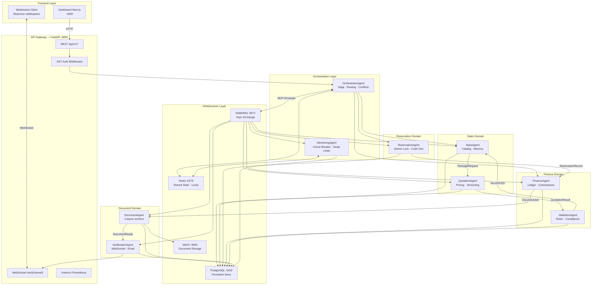
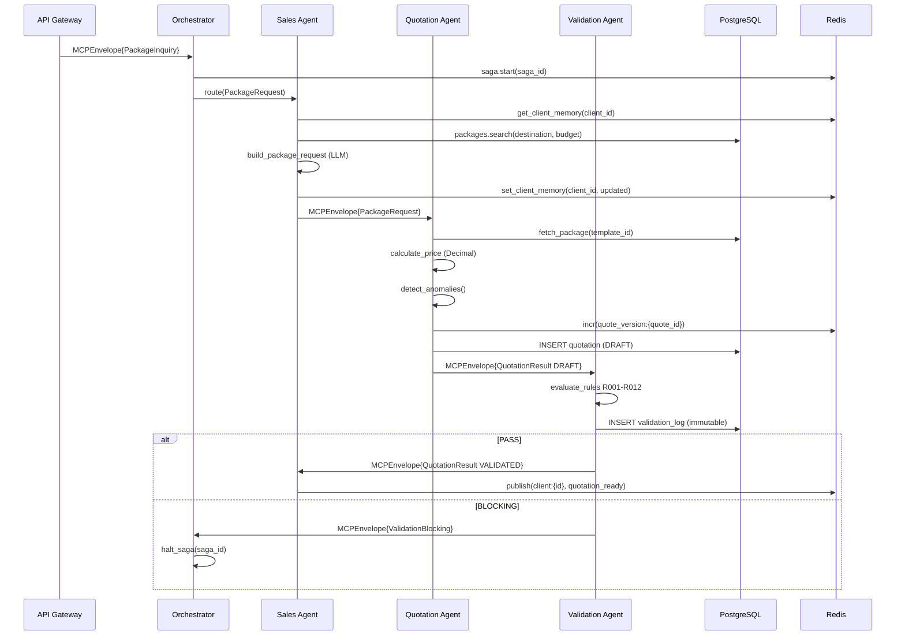
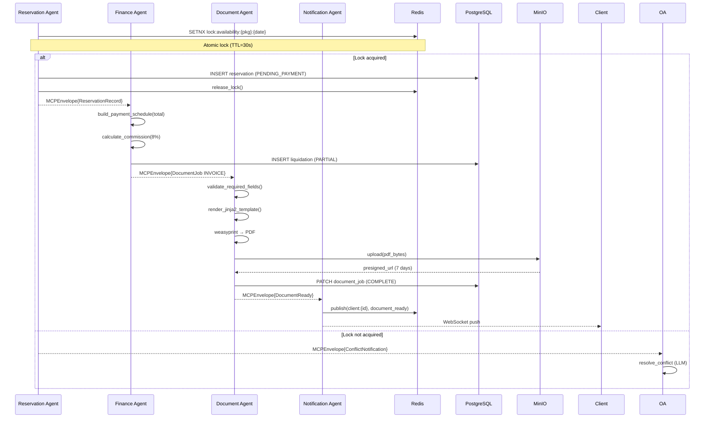
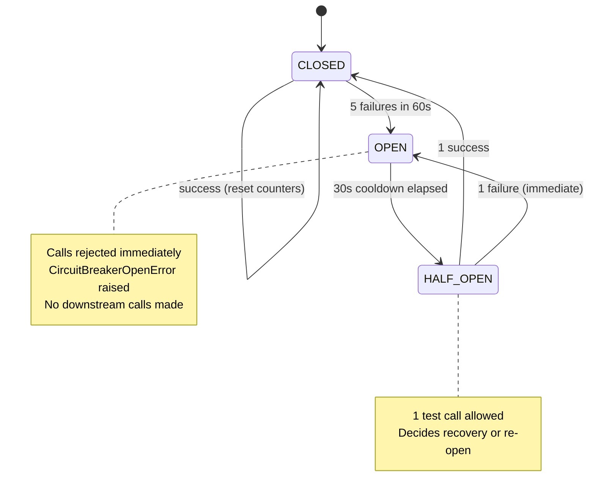
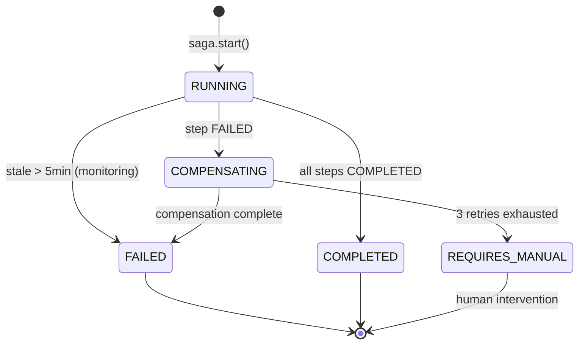
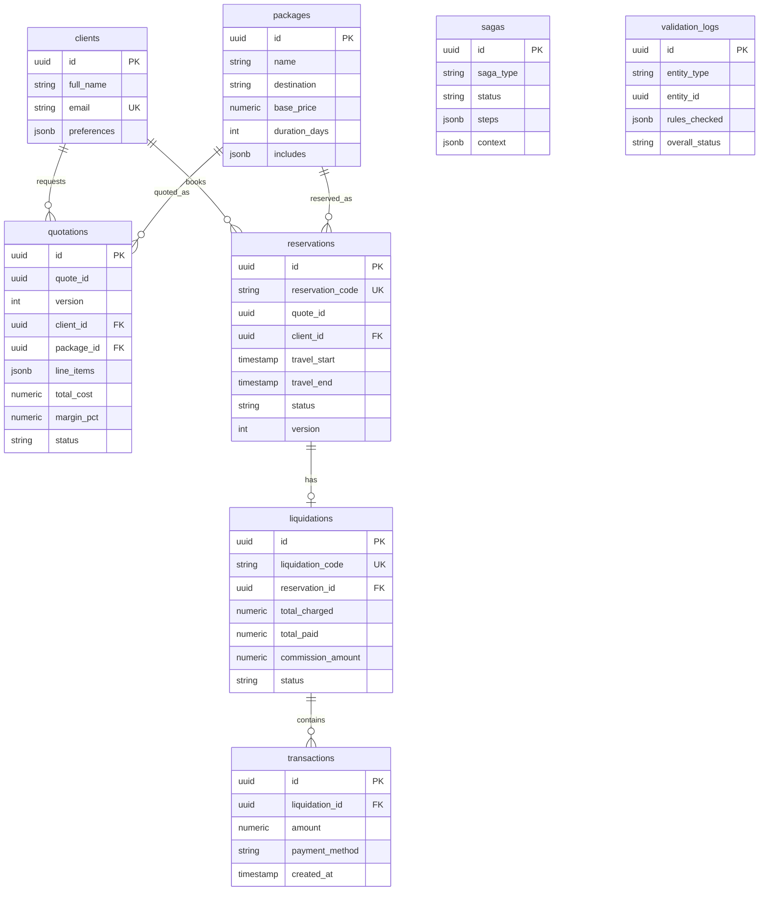
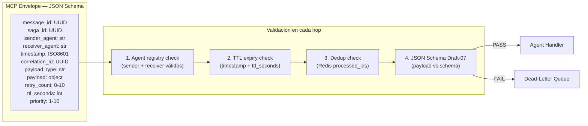

# Arquitectura del Sistema Multiagente — Everywhere Travel

## 1. Diagrama de Componentes (Mermaid)



## 2. Diagrama de Secuencia — Escenario A: Paquete Personalizado



## 3. Diagrama de Secuencia — Escenario C: Reserva + Liquidación + Documentos



## 4. Diagrama de Estado — Circuit Breaker



## 5. Diagrama de Estado — Saga



## 6. Diagrama ER — Entidades principales



## 7. Flujo de Mensajes MCP



## 8. Shared State Architecture

```
Redis Key Space:

saga:{uuid}                → SagaState JSON           TTL: 1h
lock:{type}:{id}           → agent_id (owner)         TTL: 30s
processed:{message_id}     → "1"                      TTL: 24h
heartbeat:{agent_id}       → AgentHeartbeat JSON       TTL: 90s
circuit:{service}          → CircuitState JSON         TTL: 5min
circuit:failures:{service} → int counter               TTL: 60s
memory:client:{id}         → ClientMemory JSON         no TTL
notif:{type}:{ref_id}      → "1" (dedup)              TTL: 60s

PostgreSQL Tables (persistent):
quotations    → versionadas, inmutables por (quote_id, version)
validation_logs → inmutables (no UPDATE/DELETE en producción)
sagas         → audit trail de flujos
transactions  → ledger financiero inmutable
```
